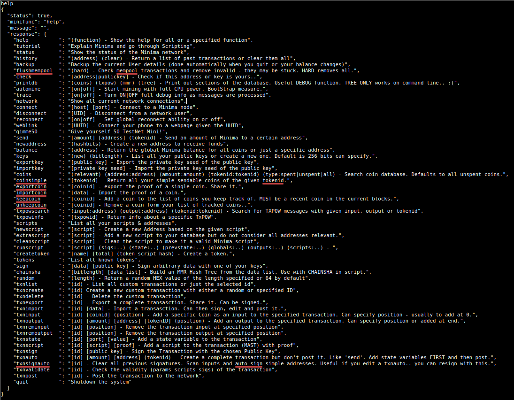

# How to Build Your First MiniDapp

This is a brief doc' designed to help you create your first Minima MiniDapp. And in the best traditions of Computing, the MiniDapp we'll create outputs a version of the immortal words, _"Hello World"_. Obvs.

## Prerequisites

First, clone the [MiFi](https://github.com/glowkeeper/MiFi) repository to a local directory (since you're reading a file in that repository, you _may_ have already done that).

Then do the same with the [Minima](https://github.com/spartacusrex99/Minima) repository. Change to its directory, and type:

````
java -jar ./jar/minima.jar
````

Importantly, for our purposes, that command fires up a MiniDapp Server on port [21000](http://localhost:2100) of your local machine. We'll use that, later.

As a brief aside, you could also start the MiniDapp Server via:

````
cd bin

java org.minima.Start
````

That could come in useful to you sometime in the future, should you ever need (or want) to change something in the Minima source, since when you build that source, that's how you'll fire up your new build.

## Creatively Commandeer

There is no need to start from scratch when creating your first MiniDapp - the [MiFi](https://github.com/glowkeeper/MiFi) repository  already contains some examples, so we'll commandeer one of those - [cowsay](https://github.com/glowkeeper/MiFi/www/minidapps/cowsay). Change to your cloned MiFi directory, then:

```
cd www/minidapps
cp -R cowsay helloWorld
```

## Introduce Your MiniDapp to the World

If all has gone well, you should now have a `helloWorld` directory containing all the goodness (and more) of [cowsay](https://github.com/glowkeeper/MiFi/www/minidapps/cowsay). Open that directory in your favourite IDE - here's what it that looks like in [atom](https://atom.io/):


First thing we're going to do is tidy up a bit by removing things we don't need and renaming those that we do:

1. Rename `cowsay.css` to `helloWorld.css`
2. Rename all the files in the `images` directory so they say `helloWorld`, rather than `cowsay`. Better still, if you are able to create your own amazing artwork for `helloWorldBackdrop.png`, `helloWorldBody.png` and `helloWorldicon.png`, do so now ;)
3. Remove the `cowsay.js` and `io.js` files from the `js` directory, since they are no longer required (fyi, `io.js` makes `cowsay` do some io, and `cowsay.js` was a CommonJS port of https://github.com/schacon/cowsay)

Now your Directory should look like this:


We're going to make the helloWorld MiniDapp say, well, _"Hello World!"_ (or something similar). Edit `index.html`, and make it look like this:

```
<html>

<head>

	<script type="text/javascript" src="./js/minima.js"></script>

	<!--  STYLE -->
	<link rel="stylesheet" type="text/css" href="./css/helloWorld.css">

</head>

<body style="background-image: url(./images/helloWorldBody.png);">

	<script type="text/javascript">


		window.addEventListener("load", function(){
			//Listen for Minima Events
			window.addEventListener('MinimaEvent', function(evt) {});

			//Initialise MiFi
			Minima.init();
		});

	</script>

	<center>

		<div class='background'>

			<p>Hello (decentralised) World!</p>

		</div>

	</center>

</body>

</html>
```

Finally, make your `minidapp.conf` look like this:

```
{
	"name":"Hello World",
	"background":"./images/helloWorldBackdrop.png",
	"icon":"./images/helloWorldIcon.png",
	"description":"Hello (decentralised) World",
	"category":"Development"
}
```

## Zip up your (first) MiniDapp

If you look in the directory containing all the MiniDapps, you'll see a file called `buildscript.sh`. Add `helloWorld` to the end of that:

```
#!/bin/sh

rm -rf ./bin

mkdir bin

zip -r ./bin/futurecash.minidapp futurecash

zip -r ./bin/terminal.minidapp terminal

zip -r ./bin/scriptide.minidapp scriptide

zip -r ./bin/dexxed.minidapp dexxed

zip -r ./bin/coinflip.minidapp coinflip

zip -r ./bin/blockx.minidapp blockx

zip -r ./bin/cowsay.minidapp cowsay

cp ./miniwallet/wallet.minidapp ./bin/

zip -r ./bin/helloWorld.minidapp helloWorld
```

Now drop out of your favourite editor (if it's not [atom](https://atom.io/), why not?), and run `buildscript.sh`. If all went well, you should have a number of `.minidapp` files in you MiFi repository's [www/minidapps/bin](www/minidapps/bin) directory, including `helloWorld.minidapp`. It's time to introduce it to the world!

## Hello World!

[Earlier](#prerequisites), we fired up a MiniDapp Server on port 21000 - we're going to connect to that now. Start your favourite browser ([Firefox](https://www.mozilla.org/en-GB/firefox/new/)), and load [http://localhost:21000](http://localhost:21000). If all has gone well, you should see something like this:


Click on `Install`, then go find the `helloWorld.minidapp` we created earlier. If that went well, your screen should now look like this:


Now, click on the `Hello World MiniDapp`, and you _should_ see this:


**Boom!** Congratulations! Welcome to the world of Minima MiniDapps!

## What Next?

Although `helloWorld.minidapp` is fit for purpose (it outputs "hello World!" (almost)), it doesn't actually interact with the Minima network. So the obvious next step is to do just that and investigate the Minima API. A good way of seeing what's available there is to run the `terminal` minidapp (which we created earlier when we ran `buildscript.sh`). Install that, load it, then type help:



You could get some ideas from the other minidapps, too - for example, [cowsay](https://github.com/glowkeeper/MiFi/www/minidapps/cowsay) makes use of the Minima `random` command. But there are endless more possibilities...

Good luck!
